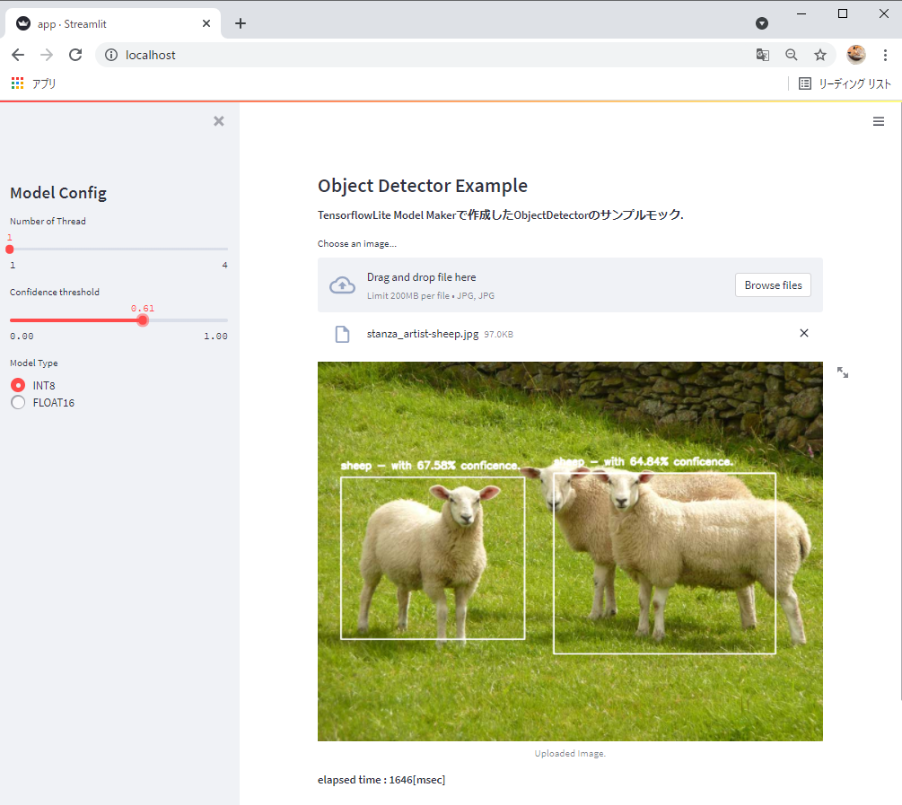

# ObjectDetection-Streamlit

# Overview

TensorflowLite Model Makerで作成したObject DetectionモデルをStreamlit上で試すデモリポジトリです。

docker-composeとnginxを利用してベーシック認証を組み込んでいます。



# Environment

- Docker Compose

# Usage

1. モデルの準備
   
   ```streamlit/weights```配下に以下のファイルを格納する。
   - labelmap.txt
   - model_fp16.tflite
   - model_int8.tflite
   
   ※モデルは[このリポジトリ](https://github.com/T-Sumida/TfLiteModelMaker-TfjsTaskAPI-Example)からも作成できます。

2. .htpasswdの準備
   
   ```nginx/auth```配下に```.htpasswd```を作成する。

3. デモを実行
   
   以下コマンドを実行する。

   ```shell
    $docker-compose up
   ```

# Author

T-Sumida[（https://twitter.com/sumita_v09）](https://twitter.com/sumita_v09)

# License

ObjectDetection-Streamlit is under [Apache-2.0 License](./LICENSE).
